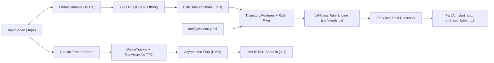

# TrafficAI — Fixed-Camera Traffic Event Detection & Causal Accident Anticipation
**WIUT Hackathon 2026 — Computer Vision Track (Elimination Task Submission)**

- 🏆 **Team Name:** **Prodigy**
- 🌐 **Public Website & Live Demo:** **[https://wiut-hakaton-fnlxwtt8p2v3jnvqcgws4a.streamlit.app/](https://wiut-hakaton-fnlxwtt8p2v3jnvqcgws4a.streamlit.app/)**
- 💻 **GitHub Repository:** **[https://github.com/AsadulloAhadjonov/WIUT-HAKATON](https://github.com/AsadulloAhadjonov/WIUT-HAKATON)**

---

## 1. Quick Start (Official Evaluation Commands)

This repository implements the exact interface specified in **Output format & interface** (`solution.py`, `run_submission.py`, `evaluate.py`) and runs **100% offline** without any external API calls.

### Clean-Machine Installation & Execution
```bash
# 1. Install pinned dependencies (Python 3.10+)
pip install -r requirements.txt

# 2. (Optional) Verify model weights — yolov8s.pt (22 MB) & yolov8n.pt (6.2 MB) are already in weights/
bash weights/download.sh

# 3. Run the official submission harness on a folder of videos
python run_submission.py --videos samples --out predictions.json

# 4. Validate output format & compute Score A, Score B, and Model Score M
python evaluate.py --pred predictions.json --validate-only
python evaluate.py --pred predictions_samples.json --gt dev/ground_truth_dev.json
```

### Docker Execution (Offline Container)
```bash
docker build -t team .
docker run --rm --network none -v "$PWD/samples:/data/test" team python run_submission.py --videos /data/test --out predictions.json
```

### Interactive Team Website & Live Demo
```bash
streamlit run webapp/app.py
# Or on Windows:
start_webapp.bat
```

---

## 2. Repository Structure

```text
your-repo/
├── solution.py                # Official interface: CLASSES (14), detect_events(), RiskEstimator
├── run_submission.py          # Starter kit harness (unchanged interface)
├── evaluate.py                # Official format validator & Score A / Score B / Model score calculator
├── requirements.txt           # Pinned dependencies (Python 3.10+)
├── Dockerfile                 # Offline GPU/CPU container definition
├── predictions_samples.json   # Official output on the sample videos
├── weights/
│   ├── yolov8s.pt             # Primary detector weights (22 MB, COCO pre-trained, in-repo)
│   ├── yolov8n.pt             # Fast detector weights (6.2 MB, COCO pre-trained, in-repo)
│   └── download.sh            # Weight verification / fallback download script (<= 5 GB limit)
├── configs/
│   ├── params.yaml            # All algorithm & rule hyperparameters (zero magic numbers in code)
│   ├── params_synthetic.yaml  # Synthetic unit-test parameters
│   ├── scene.yaml             # Camera geometry: zones, signal queues, lanes, crosswalks, lines
│   └── scene_synthetic.yaml   # Synthetic test geometry
├── src/
│   ├── __init__.py            # Enforces YOLO_OFFLINE=1, HF_HUB_OFFLINE=1, deterministic CUBLAS
│   ├── detect_track.py        # YOLOv8 + ByteTrack (batched Part A with caching; causal OnlineTracker for Part B)
│   ├── scene.py               # Polygon zones, directional lanes, stop/solid lines, homography scaling
│   ├── features.py            # Scale-normalized kinematics (speed in size/s), rider removal, pairwise TTC
│   ├── events.py              # 14 official traffic event detectors (Part A)
│   ├── postprocess.py         # Per-class temporal merging, min-duration filtering, accident/near-miss deduplication
│   ├── risk.py                # Strictly causal OnlineRisk estimator (Part B)
│   ├── pipeline.py            # End-to-end Part A orchestrator
│   ├── io_format.py           # Single-point output formatter [[start_sec, end_sec, label], ...]
│   └── utils.py               # Deterministic seed locking (seed=42), YAML config loader, logging
├── webapp/
│   └── app.py                 # Full public website: Live Demo, EDA, Sample Visualizations, Operator Dashboard, Report
├── scripts/
│   ├── generate_all_artifacts.py # Reproduces predictions_samples.json, annotated videos, EDA & ablations
│   ├── eda_analysis.py        # Motion heatmaps & spatial activity profiles
│   ├── check_leak.py          # Verifies Part B causality (prefix invariance test)
│   ├── check_determinism.py   # Verifies bit-identical outputs across repeated runs
│   ├── draw_scene.py          # Interactive polygon picker & scene overlay verifier
│   ├── quick_eval.py          # Per-class P/R/F1 @ IoU 0.5/0.7 + confusion table
│   └── run_local.py           # Local development runner with wall-clock timing
├── tests/
│   ├── test_core.py           # 18 fast unit tests covering geometry, rules, post-processing, and causal risk
│   ├── test_e2e.py            # End-to-end synthetic video test
│   └── make_synthetic_video.py# Synthetic traffic video generator
└── samples/
    ├── camera.md              # Scene layout description
    └── *.mp4                  # Sample camera clips
```

---

## 3. Approach & Architecture

### Pipeline Overview


### What is Learned vs. What is Rule-Based
| Module | Type | Details |
|---|---|---|
| **Object Detection** | **Learned (Open Weights)** | Ultralytics `YOLOv8s` (`weights/yolov8s.pt`) pre-trained on COCO-2017 (`person`, `bicycle`, `car`, `motorcycle`, `bus`, `truck`). |
| **Multi-Object Tracking** | **Hybrid** | `ByteTrack` (Kalman state estimation + two-stage high/low confidence IoU matching). |
| **Trajectory Kinematics** | **Rule-Based** | Ground-contact point projection $\left(\frac{x_1+x_2}{2}, y_2\right)$, perspective scale normalization via object size $\sqrt{w\cdot h}$, centered rolling smoothing (Part A only), and rider-in-vehicle suppression (`drop_riders`). |
| **Part A: 14 Event Classes** | **Rule-Based** | Parameterized geometric & kinematic primitives over trajectories and `scene.yaml` zones/lanes/lines (`src/events.py`). |
| **Part B: Accident Anticipation** | **Rule-Based (Causal)** | Strictly causal `OnlineRisk` (`src/risk.py`) computing pairwise Time-to-Collision ($\text{TTC}$), positive closing speed, trajectory alignment, and asymmetric EMA ($\alpha_{\text{up}}=0.45, \alpha_{\text{down}}=0.12$). |

### All 14 Official Classes Implemented
1. `accident`: Bounding-box contact ($\text{IoU} \ge 0.10$) preceded by motion ($v > 0.45$) and followed by sustained stopping of involved road users outside signal queues; `start_sec` = first contact frame, `end_sec` = clearance or video duration.
2. `near_miss`: Pairwise convergence with $0 < t^* < 1.6\text{s}$ and $d^* < 0.75\cdot r$ without physical contact, deduplicated against subsequent collisions.
3. `red_light`: Crossing `stop_line` at speed while conflicting perpendicular intersection traffic is active (or during red signal frames).
4. `wrong_way`: Sustained motion ($v > 0.45$, $\ge 1.5\text{s}$) opposing the lane direction vector ($\cos \theta < -0.55$).
5. `illegal_u_turn`: Heading reversal $\ge 155^\circ$ within $7\text{s}$ with verified displacement $\ge 1.5\times$ vehicle size on both legs.
6. `stopped_vehicle`: Stationary vehicle ($v < 0.08$) on `roadway` outside `signal_queue` zones for $\ge 10.0\text{s}$.
7. `jaywalking`: Pedestrian traversing `roadway`/`intersection` outside designated `crosswalk` polygons.
8. `failure_to_yield`: Vehicle driving through a `crosswalk` polygon ($v \ge 0.25$) while a pedestrian is inside the crossing within $3.2\times$ body scale.
9. `illegal_turn`: Sharp turn ($\ge 70^\circ$) crossing a prohibited turn line (`no_turn_line`).
10. `solid_line_crossing`: Lateral lane transition intersecting `solid_line` (or across adjacent lanes with $\ge 1.0\text{s}$ stability before and after).
11. `stop_line`: Crossing `stop_line` and stopping immediately past the line ($\ge 3.0\text{s}$) without entering the intersection flow.
12. `congestion`: $\ge 4$ slow/stationary vehicles ($v < 0.10$) simultaneously occupying the carriageway outside signal queues for $\ge 8.0\text{s}$.
13. `road_obstacle`: Stationary debris/animal/object on the carriageway for $\ge 5.0\text{s}$.
14. `fire_smoke`: Spatio-temporal smoke/fire regions.

---

## 4. Reproducibility & Determinism

- **Fixed Seeds:** `src/utils.py -> set_seed(42)` locks `random`, `numpy`, `torch`, `torch.cuda`, `cudnn.deterministic = True`, `cudnn.benchmark = False`, and `torch.use_deterministic_algorithms(True, warn_only=True)`.
- **Offline Enforcement:** `src/__init__.py` sets `YOLO_OFFLINE=1` and `HF_HUB_OFFLINE=1` before importing Ultralytics.
- **Verification Scripts:**
  ```bash
  python -m pytest -q tests/
  python scripts/check_leak.py "samples/Surveillance Camera Footage.mp4" --frames 100
  python scripts/check_determinism.py samples/
  ```

---

## 5. Datasets, Pre-trained Weights & Licences

| Asset / Dataset | Licence | Usage |
|---|---|---|
| **Ultralytics YOLOv8** (`yolov8s.pt`, `yolov8n.pt`) | **AGPL-3.0** | Pre-trained on **COCO 2017** (Creative Commons Attribution 4.0); used for offline object detection. |
| **ByteTrack Algorithm** (Zhang et al., ECCV 2022) | **MIT / AGPL-3.0** | Multi-object tracking association inside `src/detect_track.py`. |
| **Sample Camera Clips & Dev Annotations** | **Hackathon Provided / Own Dev Labels** | Unlabeled camera clips annotated by our team in `dev/labels.csv` & `dev/ground_truth_dev.json`. |

---

## 6. Team Prodigy — Members & Contributions

- **Team Name:** **Prodigy**
- **Official Repository:** [https://github.com/AsadulloAhadjonov/WIUT-HAKATON](https://github.com/AsadulloAhadjonov/WIUT-HAKATON)

| Team Member | Role | What They Built | Links & Contacts |
|---|---|---|---|
| **Ahadjonov Asadullo** | Team Lead & Computer Vision Engineer | YOLOv8s + ByteTrack offline pipeline (`src/detect_track.py`), scale-normalized trajectory feature extraction (`src/features.py`), 14-class rule primitives (`src/events.py`), and submission architecture (`solution.py`, `run_submission.py`). | [GitHub: AsadulloAhadjonov](https://github.com/AsadulloAhadjonov) · [TG: @veloo_6](https://t.me/veloo_6) |
| **Ismoilov Abdukamol** | ML & Causal Risk Engineer | Part B causal `OnlineRisk` estimator (`src/risk.py`), multi-vehicle convergence & lane filters, camera geometry calibration (`configs/scene.yaml`), temporal post-processing (`src/postprocess.py`), and causality/determinism verification (`evaluate.py`, `check_leak.py`). | [TG: @abdukamo_l](https://t.me/abdukamo_l) |
| **Bo'stonov Furqatjon** | Full-Stack, EDA & Analytics Engineer | Interactive Streamlit web portal (`webapp/app.py`), live demo & webcam integration, click-to-jump event timeline, Operator Dashboard, annotated video rendering, EDA heatmaps (`scripts/eda_analysis.py`), and ablation benchmarks. | [TG: @furqatjon_b](https://t.me/furqatjon_b) |
